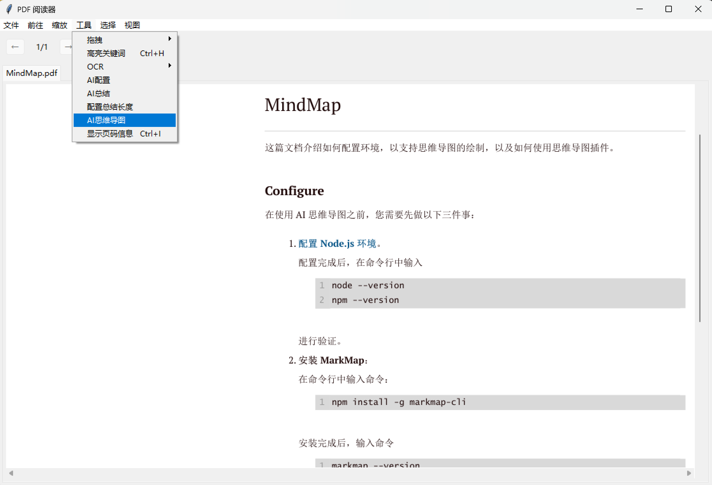
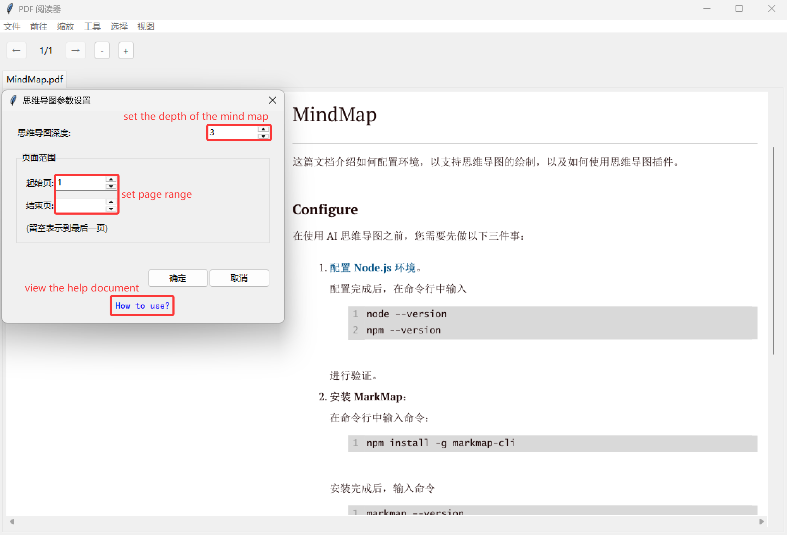
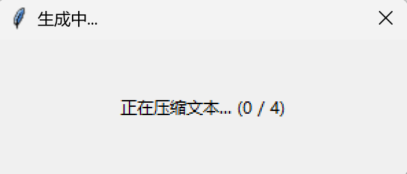
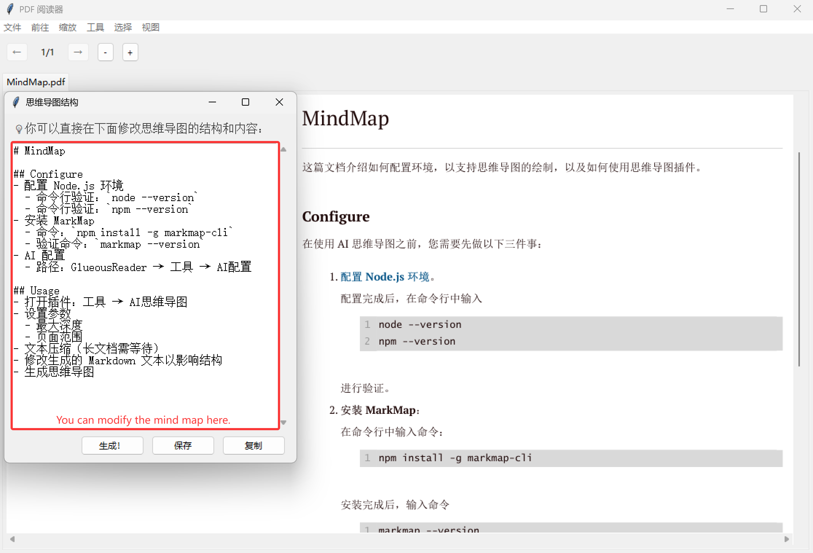
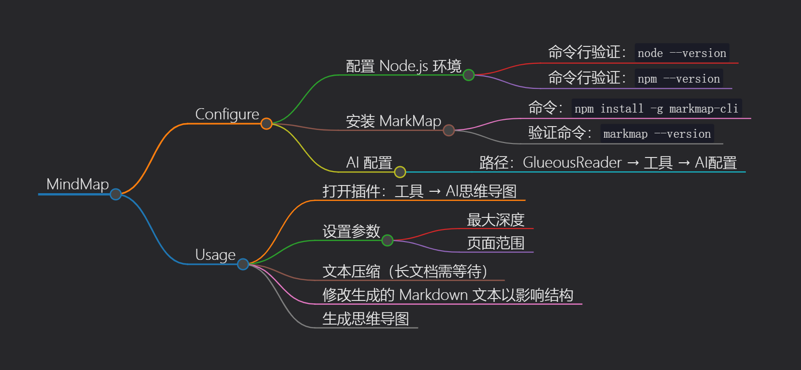

# MindMap

这篇文档介绍如何配置环境，以支持思维导图的绘制，以及如何使用思维导图插件。

## Configure

在使用 AI 思维导图之前，您需要先做以下三件事：

1. **[配置 Node.js 环境](https://www.kimi.com/share/19aab821-cee2-8215-8000-000068523512)**。

    配置完成后，在命令行中输入

    ```console
    node --version
    npm --version
    ```

    进行验证。

2. **安装 MarkMap**：

    在命令行中输入命令：

    ```console
    npm install -g markmap-cli
    ```

    安装完成后，输入命令

    ```console
    markmap --version
    ```

    进行验证。

3. AI 配置。

    在 GlueousReader 的顶部菜单栏中点击 `工具 → AI配置` 进行配置。

## Usage

完成配置后，您可以从顶部菜单：`工具 → AI思维导图` 打开思维导图插件。



1. 设置思维导图的最大深度和页面范围。

    

2. 如果整篇文档很长的话，需要等待一段时间进行文本压缩。

    

3. 生成思维导图结构，您可以通过直接修改生成的 Markdown 文本来影响思维导图的生成。

    

4. 生成思维导图。这会使用您的默认浏览器展示思维导图。

    